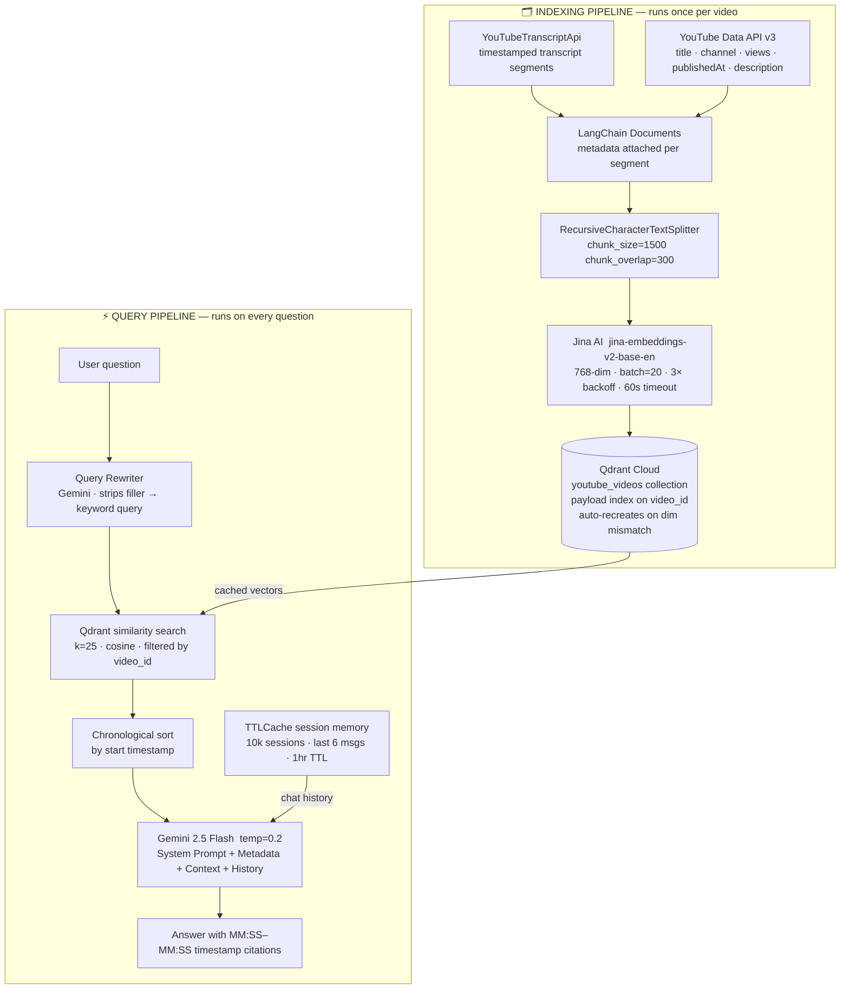

# YouTube RAG Chrome Extension — Backend

The FastAPI backend for the **YouTube RAG Chrome Extension** — a full-stack AI application that lets you have a real conversation with any YouTube video.

Ask a question, get a precise answer grounded in the transcript with exact `[MM:SS–MM:SS]` timestamp citations. No hallucinations. Just the video's own words.

---

## Architecture

Two distinct pipelines power the system:



---

## API Endpoints

| Method | Endpoint  | Description                                       |
| ------ | --------- | ------------------------------------------------- |
| `GET`  | `/health` | Health check                                      |
| `POST` | `/index`  | Ingest & embed a video (skips if already indexed) |
| `POST` | `/ask`    | Answer a question about an indexed video          |

### POST `/index`

```json
{ "video_id": "dQw4w9WgXcQ" }
```

### POST `/ask`

```json
{
  "session_id": "user-abc-123",
  "video_id": "dQw4w9WgXcQ",
  "question": "What did the speaker say about dropout regularization?"
}
```

---

## Project Structure

```
youtube_rag/
├── main.py                  # FastAPI app + CORS + dotenv bootstrap
├── requirements.txt
├── runtime.txt
├── api/
│   └── routes.py            # /index and /ask route handlers
├── services/
│   ├── ingestion.py         # Transcript + metadata fetching → Documents
│   ├── indexing.py          # Chunking + batched embedding + vector upsert
│   ├── retrieval.py         # Query rewriting + Qdrant similarity search
│   ├── generation.py        # Context formatting + Gemini answer generation
│   └── rag_service.py       # Thin orchestrator: retrieve → generate
├── core/
│   ├── embeddings.py        # Jina AI embeddings (with 60s timeout patch)
│   └── llm.py               # Gemini ChatGoogleGenerativeAI (temp=0.2)
├── memory/
│   └── session_memory.py    # TTLCache: 10k sessions, 6 msgs, 1hr TTL
└── vectorstore/
    └── qdrant_store.py      # Qdrant client, collection bootstrap, dimension guard
```

---

## Key Design Decisions

| Decision               | Choice                                       | Why                                                                               |
| ---------------------- | -------------------------------------------- | --------------------------------------------------------------------------------- |
| **Embeddings**         | Jina AI `jina-embeddings-v2-base-en` 768-dim | Cloud API — no model weights on server; Render-friendly                           |
| **LLM**                | Gemini 2.5 Flash (temp=0.2)                  | Huge context window; fast; handles 25 chunks + metadata easily                    |
| **Vector DB**          | Qdrant Cloud                                 | Native payload filtering for per-video scoping                                    |
| **Chunking**           | 1500 chars / 300 overlap                     | Enough semantic density without losing boundary context                           |
| **Query rewriting**    | Gemini pre-process                           | Strips filler words that degrade cosine similarity                                |
| **Top-K**              | k=25                                         | Covers topics spread across a long video without LLM context bloat                |
| **Chronological sort** | Post-retrieval sort by `start`               | LLM reads context in the order the speaker actually explained it                  |
| **Batch size**         | 20 chunks, 3× retry + backoff                | ~30k chars/request — well within Jina limits; auto-recovered from transient drops |
| **Embedding timeout**  | 60s injected on `session.request`            | Jina has no default timeout — prevents silent hangs                               |
| **Ingestion cache**    | Qdrant existence check                       | One-time cost per video; repeat questions are near-instant                        |
| **Dimension guard**    | Auto-recreate collection on mismatch         | Prevents silent failures if embedding model is swapped                            |
| **Session memory**     | `cachetools.TTLCache` in-memory              | No DB needed for ephemeral chat; stateless deployment-safe                        |
| **System prompt**      | Strict formatting rules                      | Structured markdown responses with bullets, bold, and grouped timestamps          |

---

## Setup

### Prerequisites

- Python 3.11+
- [Qdrant Cloud](https://cloud.qdrant.io/) account (free tier works)
- Google Gemini API key
- YouTube Data API v3 key
- Jina AI API key

### 1. Clone & Create Virtual Environment

```bash
cd youtube_rag
python3 -m venv venv
source venv/bin/activate   # Windows: venv\Scripts\activate
```

### 2. Install Dependencies

```bash
pip install -r requirements.txt
```

### 3. Configure Environment Variables

Create a `.env` file in `youtube_rag/`:

```env
GEMINI_API_KEY="your_gemini_api_key"
YOUTUBE_API_KEY="your_youtube_data_api_v3_key"
JINA_API_KEY="your_jina_ai_api_key"
QDRANT_URL="https://your-cluster.qdrant.io"
QDRANT_API_KEY="your_qdrant_cloud_api_key"

# Optional
LLM_MODEL="gemini-2.5-flash"
PORT=8000
```

### 4. Run the Server

```bash
uvicorn main:app --host 0.0.0.0 --port 8000 --reload
```

The API will be available at `http://localhost:8000`.

---

## Tech Stack

| Layer             | Technology                                           |
| ----------------- | ---------------------------------------------------- |
| API Framework     | FastAPI + Uvicorn                                    |
| Transcript        | `youtube-transcript-api` v1.2.4 (instance-based)     |
| Video Metadata    | YouTube Data API v3                                  |
| Document Pipeline | LangChain                                            |
| Text Splitting    | `RecursiveCharacterTextSplitter` (1500/300)          |
| Embeddings        | Jina AI `jina-embeddings-v2-base-en` (768-dim)       |
| Vector Database   | Qdrant Cloud                                         |
| LLM               | Google Gemini 2.5 Flash via `langchain-google-genai` |
| Session Memory    | `cachetools.TTLCache`                                |
| Deployment        | Render                                               |

---

_Last updated: March 2026 — Migrated embeddings from HuggingFace BGE-Small (384-dim local) → Jina AI (768-dim cloud). Upgraded `youtube-transcript-api` to v1.2.4. Fixed batch_size to 20, injected 60s Jina request timeout, added load_dotenv() to main.py._
